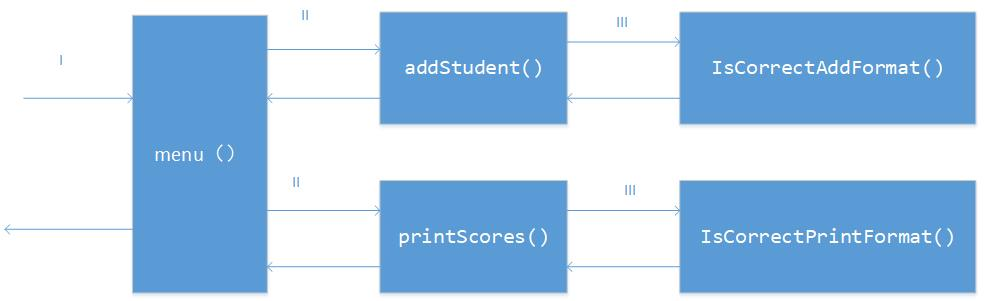

# 题目划分



```
#1 menu
输入：
	Students：[Student]
输出：
	Students：[Student]
	answer:Number
#2 addStudent
输入：
	student:Student
	isCorrectAddFormat:boolean
输出：
	Students：[Student]
#3 printScores
输入：
	student:Student
	isCorrectPrintFormat:boolean
输出：
	Students：[Student]
#4 IsCorrectAddFormat
输入：
	student:Student
输出：
	isCorrectAddFormat:boolean
#5 IsCorrectPrintFormat
输入：
	student:Student
输出：
	isCorrectPrintFormat:boolean
```

